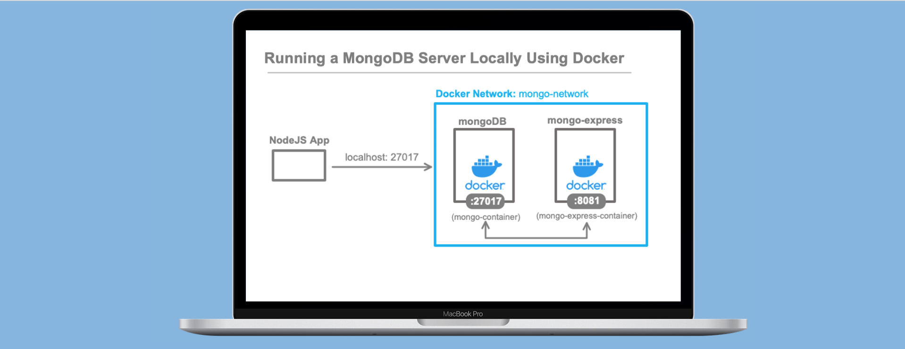

# Running a MongoDB Server Locally Using Docker 


## 1) Pull mongoDB and mongo-express images from Docker Hub
```dockerfile
docker pull mongo:latest
docker pull mongo-express:latest
```
Run `docker images` to view the pulled images.

## 2) Create the Docker Network
```dockerfile
#docker network create <your-network-name>
docker network create mongo-network
```
Run `docker network ls` to view the created network.

## 3) Configure mongoDB    
```dockerfile
#example config script
docker run -d \
    -p 27017:27017 \
    --name mongo-container \
    --network mongo-network \
    -e MONGO_INITDB_ROOT_USERNAME=mongoadmin \
    -e MONGO_INITDB_ROOT_PASSWORD=secretpassword \
    mongo:latest
```
Use `docker ps` to check if the container is running successfully.

Optionally, run `docker exec -it <container ID> bash` to open the MongoDB shell, then run `mongosh`.
Press "CTRL + D" to exit out of the shell.

## 4) Configure mongo-express
```dockerfile
#example config script
docker run -d \
    -p 8081:8081 \
    --name mongo-express-container \
    --network mongo-network \
    -e ME_CONFIG_MONGODB_ADMINUSERNAME=mongoadmin \
    -e ME_CONFIG_MONGODB_ADMINPASSWORD=secretpassword \
    -e ME_CONFIG_MONGODB_SERVER=mongo-container \
    mongo-express:latest
```
Confirm that "mongo-container" and "mongo-express-container" are running with `docker ps`


## 5) Access mongo-express Container
Open `localhost:8081` to access the mongo-express database admin portal. 

Connect your web app to "mongo-container" through `PORT 27017` and start developing. 


# Option 2: Using A docker-compose file:

Create a `local-mongodb-server.yaml` file:
```yaml
version: '3.5'

services:

  mongo-container:
    image: mongo:latest
    restart: always
    networks:
      - mongo-network
    ports:
      - ${MONGODB_PORT}:27017
    environment:
      MONGO_INITDB_ROOT_USERNAME: ${MONGODB_ROOT_USERNAME}
      MONGO_INITDB_ROOT_PASSWORD: ${MONGODB_ROOT_PASSWORD}

  mongo-express-container:
    image: mongo-express:latest
    restart: always
    networks:
      - mongo-network
    ports:
      - 8081:8081
    environment:
      ME_CONFIG_MONGODB_ADMINUSERNAME: ${MONGODB_ADMIN_USERNAME}
      ME_CONFIG_MONGODB_ADMINPASSWORD: ${MONGODB_ADMIN_PASSWORD}
      ME_CONFIG_MONGODB_SERVER: ${MONGODB_SERVER}

networks:
  mongo-network:
    driver: bridge
```

Use `docker ps` to make sure that no containers are currently running

Run both containers using: 
```bash
#run local-mongodb-server.yaml file
docker-compose -f local-mongodb-server.yaml
```
Open `localhost:8081` to access the mongo-express database admin portal. 


